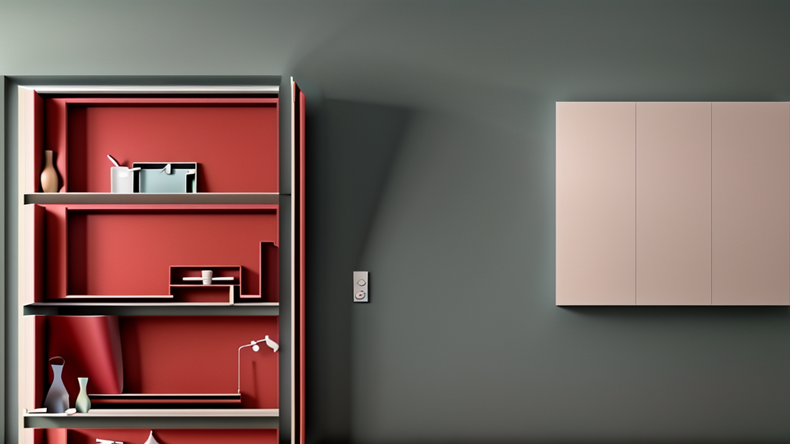

# Output using the given prompts and images

Yes, we can generate images with different aspect ratio even the original image is of a fixed set ratio. While the quality of the generated image is not as good as the other results, it is still presentable at best.

The generation latency while depending on many factors like the number of steps we take to filter out the noise of the image and the resolution we choose also depends on the type of method we choose to generate the image. We can also upscale an image from any resolution but in the process, we lose the image’s fidelity and hence, compromise our time as well as our gpu power. But reduced latency doesn’t always mean a better result. An image can take more time to generate if we increase the number of steps for denoising the image and increase the resolution which in turn gives high fidelity and sharper images meanwhile, an image with lesser number of steps as well as a lesser resolution will take less time but will have significantly worse result.

# About the Workflow

1. Load Image:
   • Description: Loads the input image (if any) for further processing or to condition the diffusion model on an existing image.
   • Purpose: This serves as the basis for generating new images or applying transformations, like using it in the “image-to-image” process.
2. Load Checkpoint:
   • Description: This involves loading the pre-trained model weights (checkpoint) necessary to perform inference.
   • Purpose: These checkpoints contain the parameters that were learned during training, which are needed to generate or modify images using the Stable Diffusion model.
3. Clip Text Encode (+ve):
   • Description: The CLIP model encodes the positive (desired) text prompt into a latent space.
   • Purpose: This transforms user input text into a form that can guide the diffusion process, influencing how the image should align with the positive description.
4. Clip Text Encode (-ve):
   • Description: CLIP encodes the negative text prompt into latent space.
   • Purpose: This defines what elements should be avoided or minimized in the final image, influencing the model to disregard undesired aspects.
5. Empty Latent Image:
   • Description: Initializes a blank or empty latent image (a noise image or latent tensor) to start the denoising process.
   • Purpose: This serves as the initial input for the denoising diffusion process, which gradually reduces the noise to generate an image.
6. VAE Encode:
   • Description: Variational Autoencoder (VAE) encodes the image (or latent space representation) into a more compact latent space.
   • Purpose: Reduces the image or latent features into a format the model can efficiently process, capturing key details while discarding unnecessary noise.
7. KSampler:
   • Description: The Karras Sampler refines the generated image through multiple sampling steps.
   • Purpose: This sampler is crucial for gradually denoising the image, generating a clear, detailed image from random noise using learned diffusion patterns.
8. Apply ControlNet:
   • Description: Adds control mechanisms (like pose or depth constraints) to guide the image generation process.
   • Purpose: ControlNet gives more granular control over how the image is generated by enforcing specific structural constraints, enhancing the alignment with the user’s desired output.
9. VAE Decode:
   • Description: The VAE decodes the compact latent space representation back into pixel space to generate the final image.
   • Purpose: Converts the latent space back into a fully-formed image that humans can visualize, revealing the result of the diffusion process.
10. Preview Image:
    • Description: Displays the generated image for preview.
    • Purpose: This allows the user to view the final image after all transformations, steps, and denoising processes have been applied.

# Assignment Submitted by:

Name: Aaditya Vashishth

Personal e-mail: 02adityavashishth@gmail.com

College e-mail: 500094803@stu.upes.ac.in

Sap ID: 500094803

Contact: +919821339697
